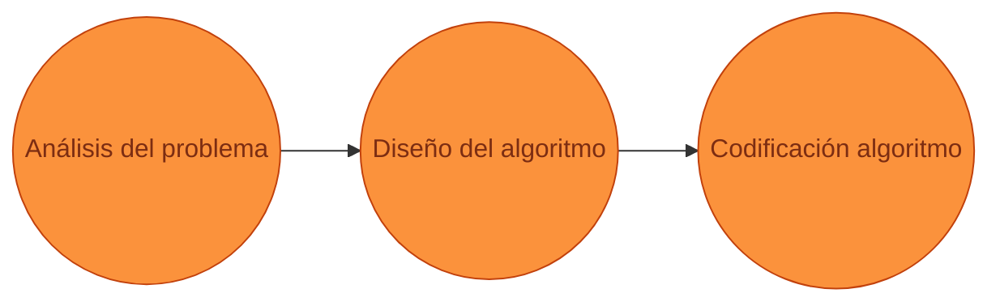
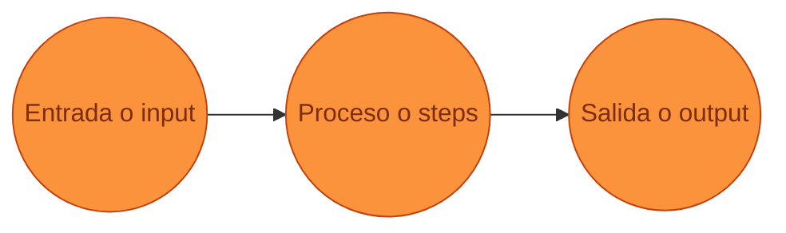
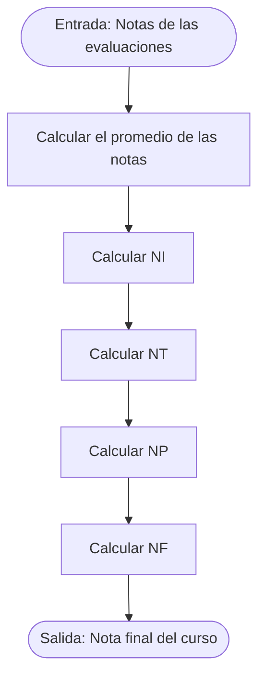

# Algoritmos
## Clase 02 | Introducción a la programación

### Nicolás Quiroz | <naquiroz@uc.cl> | <iic1103@uc.cl>
---

---
layout: section
level: 1
title: Calibración
---
# Calibración

¿Qué es un algoritmo?

¿Qué es un programa?

¿Qué es un lenguaje de programación?

¿Qué es software?

---
layout: center
level: 3
title: ¿Quiénes son ustedes?
hideInToc: true
---

# ¿Qué tanto saben programar?

---
layout: center
level: 2
title: Agenda
hideInToc: true
---

# Agenda

<Toc maxDepth=2 />

---
layout: cover
level: 2
title: Motivación
hideInToc: false
clicks: 4
---
# Motivación
## ¿Por qué es necesario el pensamiento algorítmico?
### ¿Por qué es necesario pensar en pasos ordenados?

<ImgGrid :images="['content/clase_02/mess_kitchen.avif', 'content/clase_02/cau_cau.jpeg', 'content/clase_02/music.jpeg']" do-clicks class="w-250" v-click-hide="4"/>

---
layout: center
level: 3
title: ¿Qué beneficios tiene el pensamiento algorítmico?
hideInToc: true
---
# ¿Qué beneficios tiene el pensamiento algorítmico?

El pensamiento algorítmico es una herramienta que nos permite resolver problemas de manera ordenada y sistemática.

---
layout: center
level: 3
title: ¿Cómo se resuelve un problema?
hideInToc: true
---

# ¿Cómo se resuelve un problema?

Al final del día, muchos problemas pueden resolverse con un algoritmo.

😖 -> &nbsp;🧑🏼‍💻 -> &nbsp; 🤩

---
layout: section
level: 1
title: Qué es un algoritmo
hideInToc: false
---

# ¿Qué es un algoritmo?
## Y por qué es importante

---
layout: default
level: 2
title: Acerca de los algoritmos
hideInToc: false
---
# Acerca de los algoritmos

- Hay cursos enteros dedicados a este tema, como “Diseño y Análisis de Algoritmos”
- Nosotros nos enfocaremos en el pensamiento algorítmico, introduciendo conceptos básicos para poder resolver a la velocidad de la luz ⚡️
- Los algoritmos son una herramienta bastante estudiada que permiten dividir un problema en pasos ordenados más sencillos de abordar y ordenar.

---
layout: center
level: 2
title: Definición de algoritmo
hideInToc: false
---
# Definición de algoritmo

- Un algoritmo es un **conjunto de instrucciones o reglas definidas** y no ambiguas, **ordenadas y finitas** que permite **solucionar un problema**, realizar un cómputo, procesar datos y llevar a cabo otras tareas o actividades.

- Por ejemplo, para que **un computador** pueda realizar una suma, **debe seguir un algoritmo que le indique cómo hacerlo**.

- ¿ Qué algoritmos (además de los de un computador) se les ocurren de la vida diaria?

  🧑‍🍳
  👷
  🗺️
  🪡

---
layout: default
level: 2
title: Ejemplos de algoritmos
hideInToc: true
---
# Ejemplos de algoritmos

<ImgGrid :images="['content/clase_02/lego.jpeg', 'content/clase_02/musica.jpg', 'content/clase_02/terremoto.png']" do-clicks class="w-300" v-click-hide="4"/>

---
layout: center
level: 2
title: # Cómo programar un algoritmo
hideInToc: true
---
# ¿Qué es un algoritmo?

- Un computador al igual que un humano, necesita instrucciones para realizar una tarea. Y para ello es necesario _hablarle_.

- Para entregarle un algoritmo a un computador, es necesario utilizar un **lenguaje de programación**.

---
layout: statement
level: 2
title: Definicion
hideInToc: true
---

# Lenguaje de programación

Un lenguaje de programación es un **lenguaje formal** que especifica una serie de instrucciones para que una computadora produzca diversas clases de datos.

---
layout: section
level: 1
title: Cómo armar un algoritmo
hideInToc: false
---

# Cómo armar un algoritmo

---
layout: two-cols
level: 2
title: Proceso de creación de un algoritmo
---

# Proceso de creación de un algoritmo

Hay dos formas equivalentes de diagramar un algoritmo:

- A nivel de problema
- A nivel de computador

En este curso intentaremos siempre llevar los problemas a nivel de computador.

- **Entrada**: Recurso, dato(s) entrantes, que se necesitan para el algoritmo.
- **Proceso**: Pasos que debe seguir el algoritmo para resolver el problema.
- **Salida**: Resultado del algoritmo, que puede ser un dato o un recurso.

::right::

### A nivel de problema

### A nivel de computador

---
layout: center
level: 2
title: Ejemplo de algoritmo
hideInToc: true
---

# Ejemplo de algoritmo

- **Entrada**: Las letras del abecedario.
- **Proceso**: Por cada letra intentar una combinación de 5 letras. Repetir hasta que todas sean verdes.
- **Salida**: La combinación de letras que resultó en todas las letras verdes.
---
layout: two-cols
level: 2
title: Ejemplo de algoritmo - nota
hideInToc: true
---

# Ejemplo de algoritmo
## Calculemos nuestra nota del curso

### Sin criterios para aprobar, calculemos nuestra nota

1. **Entrada**: Notas de las evaluaciones.
2. **Proceso**: Calcular el promedio de las notas.
   1. Calcular NI
   2. Calcular NT
   3. Calcular NP
   4. Calcular NF
3. **Salida**: Nota final del curso.

::right::

