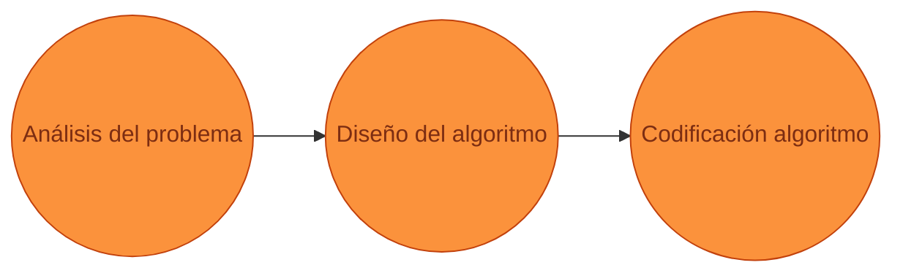

# Algoritmos
## Clase 02 | Introducción a la programación

### Nicolás Quiroz | <naquiroz@uc.cl> | <iic1103@uc.cl>
---

---
layout: section
level: 1
title: Calibración
---
# Calibración

¿Qué es un algoritmo?

¿Qué es un programa?

¿Qué es un lenguaje de programación?

¿Qué es software?

---
layout: center
level: 3
title: ¿Quiénes son ustedes?
hideInToc: true
---

# ¿Qué tanto saben programar?

---
layout: center
level: 2
title: Agenda
hideInToc: true
---

# Agenda

<Toc maxDepth=2 />

---
layout: cover
level: 2
title: Motivación
hideInToc: false
clicks: 4
---
# Motivación
## ¿Por qué es necesario el pensamiento algorítmico?
### ¿Por qué es necesario pensar en pasos ordenados?

<ImgGrid :images="['/content/clase_02/mess_kitchen.avif', '/content/clase_02/cau_cau.jpeg', '/content/clase_02/music.jpeg']" do-clicks class="w-250" v-click-hide="4"/>

---
layout: center
level: 3
title: ¿Qué beneficios tiene el pensamiento algorítmico?
hideInToc: true
---
# ¿Qué beneficios tiene el pensamiento algorítmico?

El pensamiento algorítmico es una herramienta que nos permite resolver problemas de manera ordenada y sistemática.

---
layout: default
level: 3
title: ¿Cómo se resuelve un problema?
hideInToc: true
---

# ¿Cómo se resuelve un problema?

---
layout: section
level: 1
title: Qué es un algoritmo
hideInToc: false
---

# ¿Qué es un algoritmo?
## Y por qué es importante

---
layout: default
level: 2
title: Acerca de los algoritmos
hideInToc: false
---
# Acerca de los algoritmos

- Hay cursos enteros dedicados a este tema, como “Diseño y Análisis de Algoritmos”
- Nosotros nos enfocaremos en el pensamiento algorítmico, introduciendo conceptos básicos para poder resolver a la velocidad de la luz ⚡️
- Los algoritmos son una herramienta bastante estudiada que permiten dividir un problema en pasos ordenados más sencillos de abordar y ordenar.

---
layout: center
level: 2
title: Definición de algoritmo
hideInToc: false
---
# Definición de algoritmo

- Un algoritmo es un conjunto de instrucciones o reglas definidas y no ambiguas, ordenadas y finitas que permite solucionar un problema, realizar un cómputo, procesar datos y llevar a cabo otras tareas o actividades.
